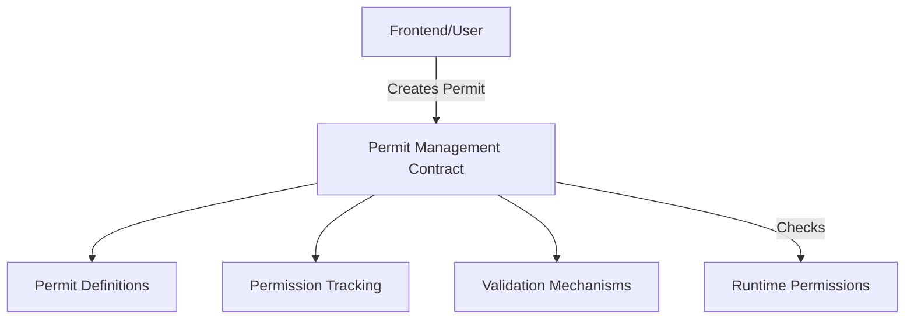

# Permit Flexible Frontend 🔐

A dynamic, secure smart contract solution for flexible frontend permission management on the Stacks blockchain, providing granular and programmable access control.

## Overview

Permit Flexible Frontend is a blockchain-powered permission management system that enables:
- Dynamic, time-bound permit creation
- Granular permission scoping
- Secure, revocable access control
- Principal-based verification

## Key Features

- **Flexible Permit Management**
  - Create permits with multiple permissions
  - Define precise time windows
  - Support for revocable and non-revocable permits

- **Secure Access Control**
  - Cryptographically verified permissions
  - Runtime permission checks
  - No centralized authority

## Architecture

The smart contract manages a flexible permission system with key components:



## Contract Data Structures

- `flexible-permits`: Stores individual permit details
- `permit-tracker`: Manages user permit inventories
- Dynamic permission lists
- Timestamp-based validation

## Getting Started

### Prerequisites
- Clarinet
- Stacks wallet

### Basic Usage

1. Create a flexible permit:
```clarity
(contract-call? .permit-flexible-frontend create-flexible-permit
    tx-sender  ;; grantee
    (list "read" "write")  ;; permissions
    block-height  ;; valid from
    (+ block-height u100)  ;; valid until
    true  ;; is revocable
)
```

2. Check permissions:
```clarity
(contract-call? .permit-flexible-frontend has-permission 
    tx-sender  ;; principal
    "read"  ;; required permission
)
```

## Function Reference

### Public Functions

#### `create-flexible-permit`
Creates a new, configurable permit
```clarity
(create-flexible-permit 
    grantee 
    permissions 
    valid-from 
    valid-until 
    is-revocable
)
```

#### `revoke-permit`
Revokes an existing permit
```clarity
(revoke-permit permit-id)
```

#### `has-permission`
Checks if a principal has a specific permission
```clarity
(has-permission grantee required-permission)
```

## Development

### Testing
1. Clone repository
2. Install Clarinet
3. Run tests:
```bash
clarinet test
```

## Security Considerations

### Design Principles
- Cryptographically secure permission verification
- No centralized permission management
- Transparent, auditable access control

### Limitations
- Permits have defined time windows
- Maximum of 10 permissions per permit
- Permits must be explicitly revoked if needed

### Best Practices
- Use the most restrictive permissions possible
- Set short, precise validity windows
- Regularly review and revoke unnecessary permits

## Contributing

Contributions are welcome! Please submit pull requests or open issues for improvements and bug fixes.

## License

MIT License

## Disclaimer

Experimental project. Use at your own risk.